# Server Services Manager

> A web-based process manager with a real-time system monitor, PTY terminal, file manager, control panel, system-services browser, log streaming, cron management, health checks, and a plugin system for Linux servers.

<p align="center">
  <a href="https://www.python.org/downloads/">
    
  </a>
  <a href="LICENSE.md">
    
  </a>
  <a href="https://github.com/Rishabh-Bajpai/server-services-manager/actions">
    
  </a>
</p>

---

## Features

### Service Management
- Start, stop, restart, and monitor services with auto-restart on failure
- **Scheduled tasks** — turn any managed program into a systemd timer (cron-style)
- **Resource limits** — per-service `CPUQuota`, `MemoryMax`, `TasksMax`, `I/O` weight, `Nice` etc. via systemd drop-in
- **Autostart on boot** — `systemctl enable` a sister `ssm-<name>.service` unit
- **State-change notifications** — fan out start/stop/fail transitions to ntfy, webhook, Telegram, or email
- **Log persistence** — service logs survive manager restarts (rotated at 512KB)
- **Backup / restore** — export your service config to JSON, re-import to merge or replace

### Host-Level Tools
- **System Services** — browse, start, stop, enable, disable, mask, and edit drop-in overrides for **any systemd unit** on the host (services, timers, sockets, paths, mounts)
- **Live Log Streaming** — real-time `journalctl -f` over Server-Sent Events for any unit, with priority filter and follow-tail
- **Dependencies Graph** — BFS visualisation of `Requires` / `Wants` / `After` / `Before` edges for any unit
- **Cron Jobs** — inspect, validate, and enable/disable system cron entries in `/etc/crontab` and `/etc/cron.d/*`

### Monitoring & Alerts
- **Health Checks** — probe each managed service (HTTP/TCP/cmd) on a configurable interval
- **Notifications** — ntfy.sh, generic webhook, Telegram bot, or SMTP email; transitions only, no spam
- **System Monitor** — real-time CPU (per-core + averaged chart), memory, swap, disk I/O, network usage, CPU temperature, and top processes with sortable columns
- **Activity Log** — append-only SQLite log of every action (program CRUD, systemd ops, cron toggle, autostart, schedule, limits) with CSV export

### UX
- **Control Panel** — Steam Deck–style quick-action buttons for reboot, suspend, lock, disk/memory checks, and custom user-defined commands
- **Command Palette** — Ctrl+K to fuzzy-search programs, control commands, and systemd units
- **Web Terminal** — multi-tab PTY terminal for direct shell access
- **File Manager** — browse, upload, and download files on the server (chrooted to `$HOME`)
- **Plugin System** — drop a Python file into `~/.server-services-manager/plugins/` to add routes, programs, or background workers
- **Real-time Updates** — live status, logs, and toasts via WebSockets
- **Process Recovery** — survives manager restarts; re-attaches to running services automatically
- **Authentication** — password-protected access with hashed credentials; sudo password reused for privileged actions
- **Responsive UI** — dark-themed, resizable panes, desktop and mobile-friendly

## Quick Start

```bash
git clone https://github.com/Rishabh-Bajpai/server-services-manager.git
cd server-services-manager
pip install -r requirements.txt
cp .env.example .env          # then set a secure password
./start.sh
```

Open **http://localhost:8881** and log in with your password.

Stop with `./stop.sh`.

## Install as a Service (recommended)

For auto-start on boot and automatic crash recovery:

```bash
bash install-service.sh
journalctl --user -u server-services-manager -f
```

## Screenshots

### Desktop

| Dashboard | System Monitor | Control Panel | System Services |
|-----------|---------------|---------------|-----------------|
| 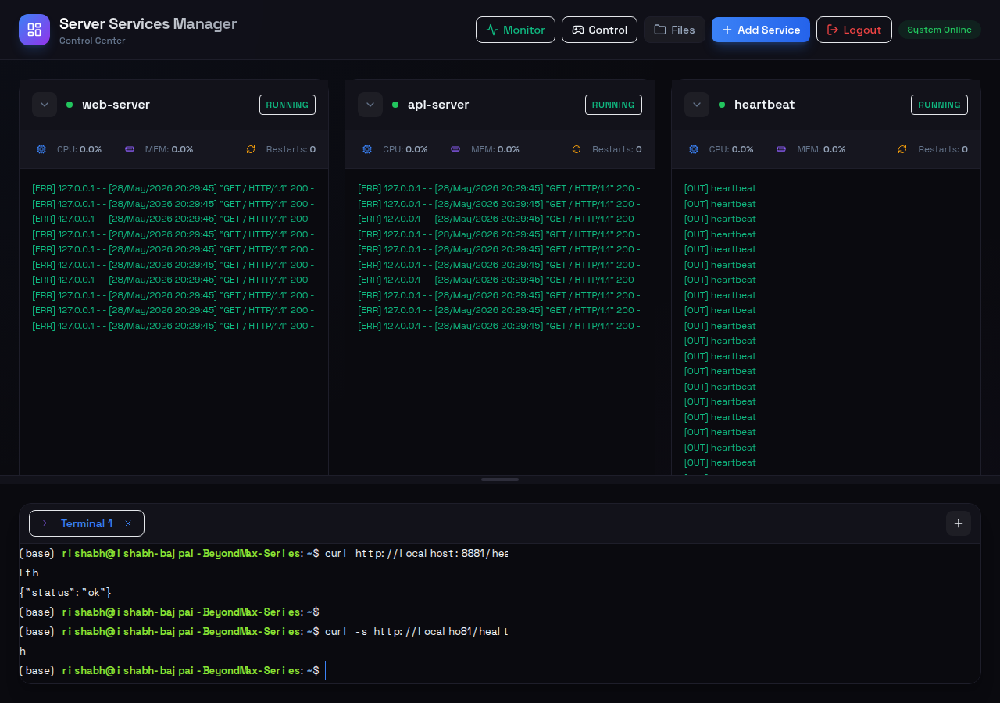 | 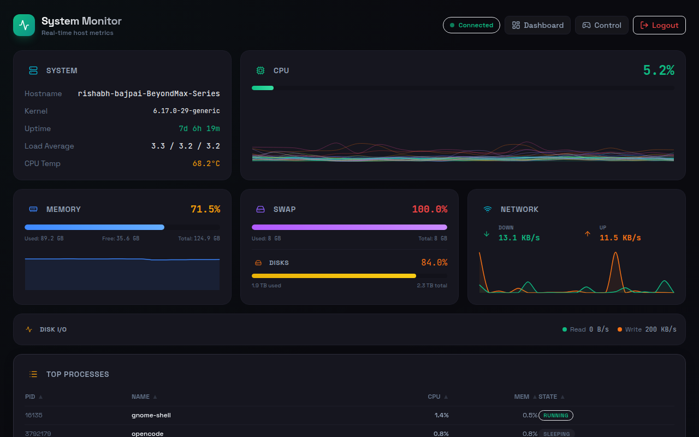 | 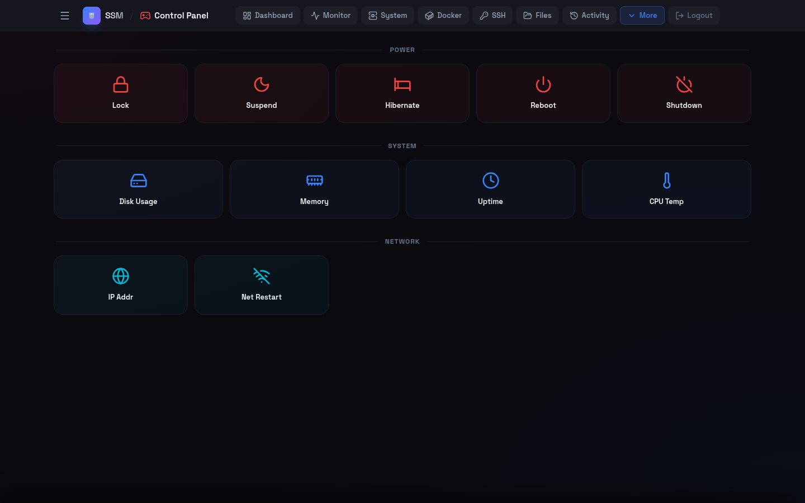 | 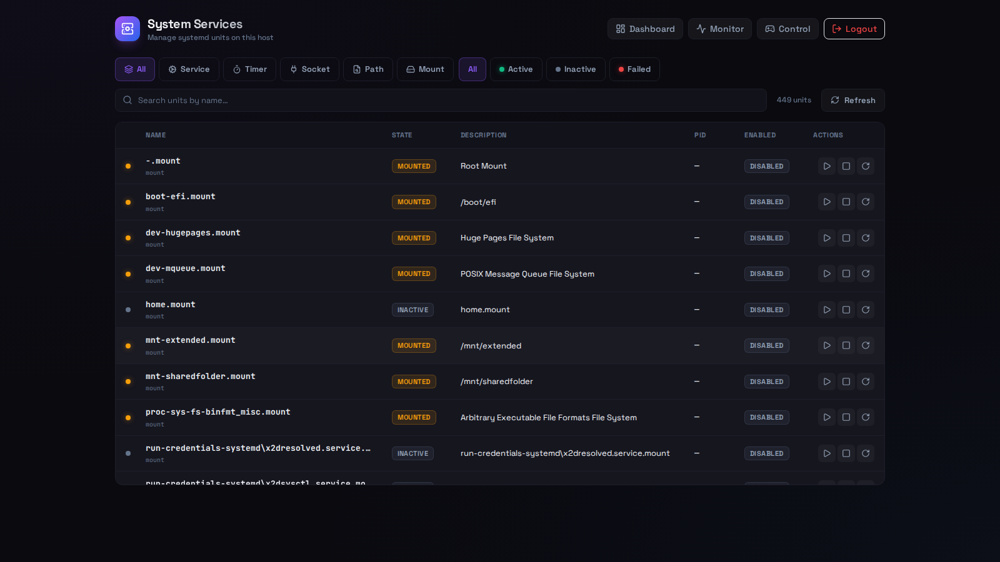 |

| Cron Jobs | Notifications | Activity | Command Palette |
|-----------|---------------|----------|-----------------|
| 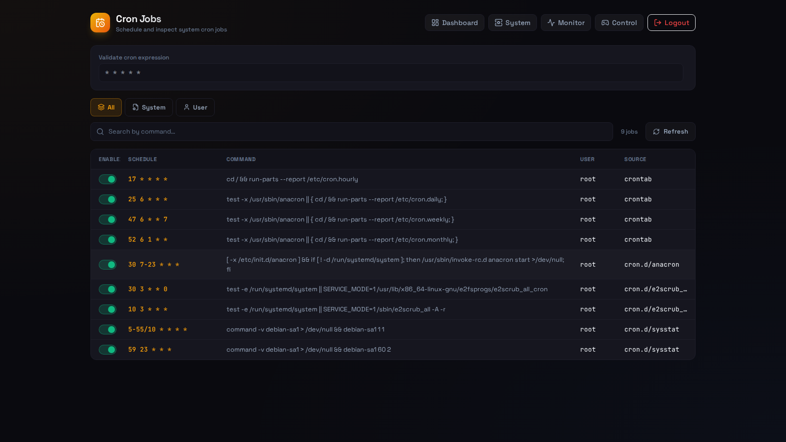 | 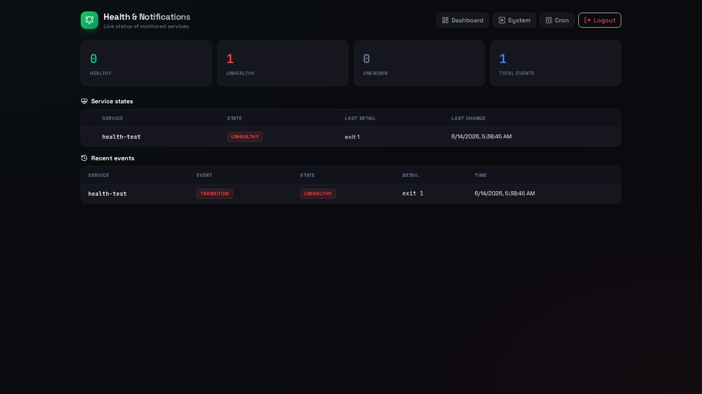 | 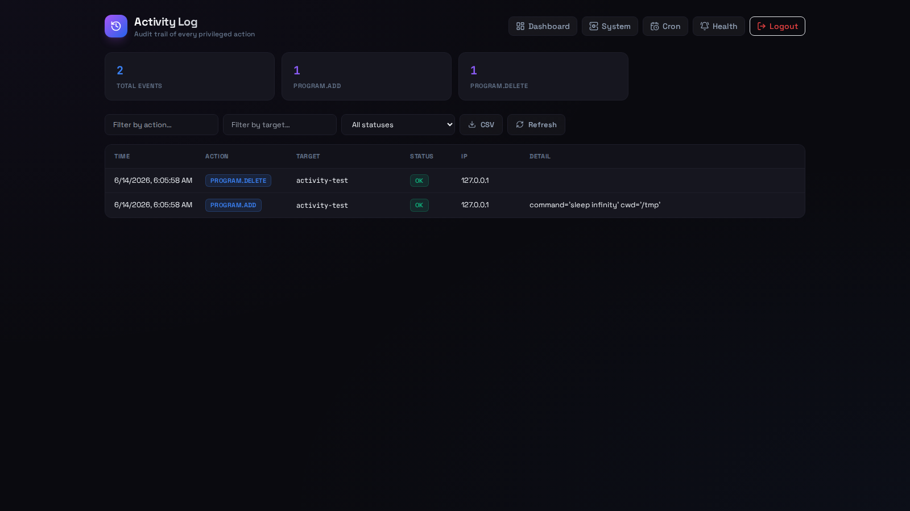 |  |

### Mobile

| Dashboard | System Monitor | Control Panel | System Services | Cron Jobs |
|-----------|---------------|---------------|-----------------|-----------|
| 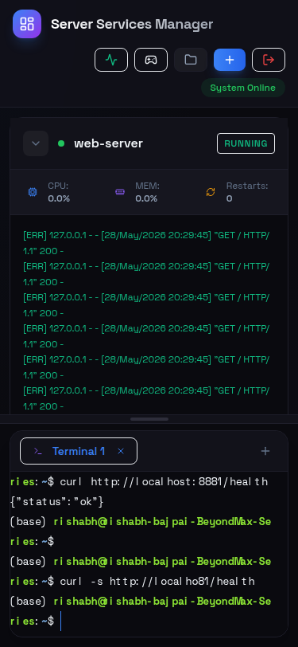 | 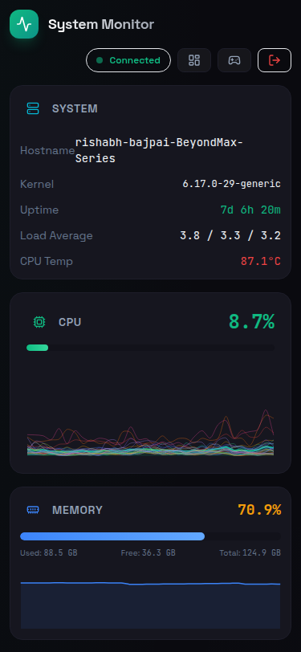 | 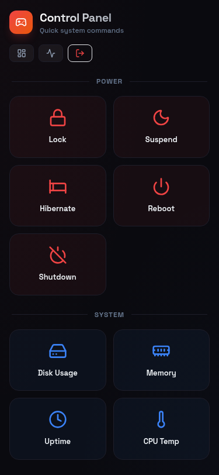 | 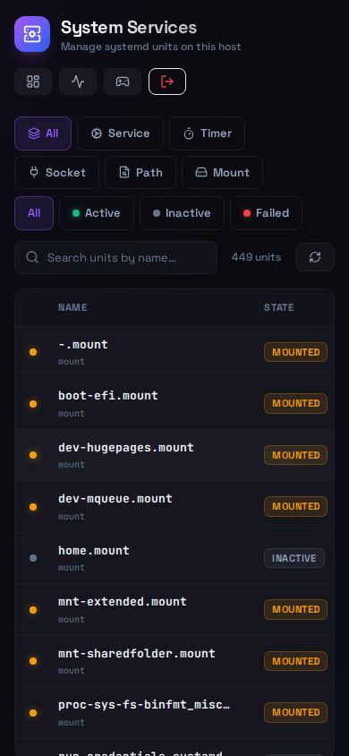 | 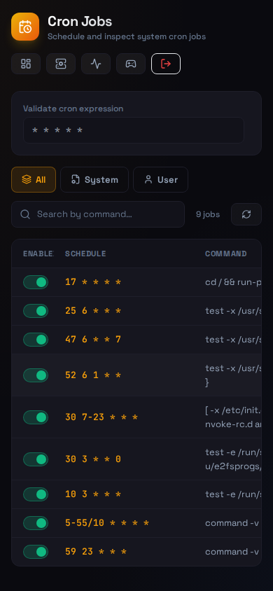 |

## Configuration

### Environment Variables (`.env`)

| Variable | Default | Description |
|----------|---------|-------------|
| `PASSWORD` | `admin` | Login password |
| `SECRET_KEY` | Auto-generated | Flask session signing key |
| `CORS_ORIGIN` | `*` | Allowed CORS origin |

### Services (`config.yaml`)

Add services via the GUI as shown below:

<p align="center">
  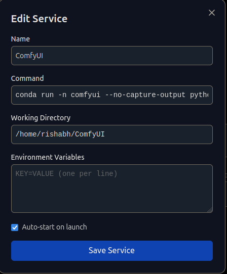
</p>

Services can also be added manually in `config.yaml`:

```yaml
programs:
  - name: my-app
    command: python my_app.py
    cwd: /home/user/my_app
    autostart: true
    schedule: ""                # optional: cron-style systemd timer
    environment:
      MY_VAR: value
    health_check:               # optional: HTTP/TCP/cmd probe
      type: http
      target: http://localhost:8080/health
      interval: 30
      timeout: 5

commands:
  - id: my-update
    name: "Update System"
    command: "apt update && apt upgrade -y"
    icon: refresh-cw
    auth: true

notifications:
  - type: ntfy
    topic: alerts
  - type: webhook
    url: https://example.com/hook
```

`config.yaml` is validated at startup against a lenient pydantic schema; unknown
fields are accepted so the config can grow without breaking the loader.

### Custom Control Panel Commands

You can add your own commands to the control panel via `config.yaml`:

```yaml
commands:
  - id: my-update
    name: "Update System"
    command: "apt update && apt upgrade -y"
    icon: refresh-cw
    auth: true
    # ^ requires password re-entry before executing
```

Available icons: any [Lucide icon](https://lucide.dev/icons) name.

### System Services Privileges

The `/system-services` page manages **all systemd units** on the host, not just services defined in `config.yaml`. Read operations (listing, status, logs, viewing the unit file) work without privileges. Write operations (start, stop, restart, reload, enable, disable, mask, edit) require sudo, which is obtained by piping your app login password to `sudo -S` for that single command.

**This means the app does not need to run as root** — only the user invoking the action needs sudo. The drop-in file editor writes to `/etc/systemd/system/<name>.d/99-manager.conf` (the standard `systemctl edit` location), so vendor-provided unit files are never touched. `daemon-reload` runs automatically after each edit.

### Scheduled Tasks (systemd timers)

Add a `schedule:` field to a program to make it a one-shot timer:

```yaml
programs:
  - name: cleanup
    command: /usr/local/bin/cleanup.sh
    cwd: /tmp
    schedule: "hourly"   # or "*-*-* *:00/15", "Mon..Fri 09:00:00", etc.
```

The manager creates `~/.config/systemd/user/ssm-cleanup.{service,timer}` and
enables the timer. The Start button on the dashboard still spawns the
subprocess directly, so manual triggers keep working. Full grammar:
[`systemd.time(7)`](https://www.freedesktop.org/software/systemd/man/latest/systemd.time.html).

### Resource Limits

Set CPU/memory/IO caps per program in the UI (Edit Service → Resource Limits)
or via the API. The drop-in lives at
`~/.config/systemd/user/ssm-<name>.service.d/99-manager.conf` and is merged
with any existing settings.

### Plugins

Drop a Python file into `~/.server-services-manager/plugins/`:

```python
from app.plugins import PluginBase

class MyPlugin(PluginBase):
    name = "my-plugin"
    version = "1.0"

    def register(self, app, pm, activity, notifier_module=None):
        @app.route("/_my_route")
        def my_route():
            return "hello"
```

A restart picks up new plugins; bad plugins are logged and skipped without
breaking the manager. See `app/plugins.py` for the full API.

## Pages

| Route | Page | Description |
|-------|------|-------------|
| `/` | Dashboard | Manage services, view logs, terminal |
| `/monitor` | System Monitor | Real-time CPU/Memory/Network charts, processes |
| `/control` | Control Panel | Quick system commands |
| `/system-services` | System Services | Browse, control, and edit any systemd unit on the host |
| `/cron` | Cron Jobs | Inspect and toggle system cron entries |
| `/notifications` | Health & Notifications | Live status of monitored services |
| `/activity` | Activity Log | Filterable history of all actions with CSV export |

## Tech Stack

| Layer | Technology |
|-------|-----------|
| Backend | Python, Flask, Flask-SocketIO, Eventlet, psutil, pydantic |
| Frontend | Vanilla JS, Tailwind CSS, Chart.js, xterm.js, Lucide icons |
| Real-time | WebSockets (Socket.IO) + Server-Sent Events (log streaming) |
| Storage | SQLite (WAL) for activity log; YAML for service config |

## Developing

```bash
# Install deps
pip install -r requirements.txt

# Run tests
python -m pytest tests/ -v --tb=short   # 524 tests

# Run with auto-reload
FLASK_DEBUG=1 python server.py
```

## License

MIT © 2025 Rishabh Bajpai
