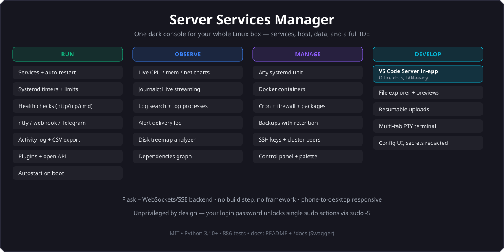

# Server Services Manager

> A web-based sysadmin console for Linux servers: managed services with auto-restart, a real-time system monitor, multi-tab PTY terminal, full file explorer, embedded VS Code Server, Docker browser, systemd unit control, cron, firewall, backups, package updates, disk analysis, SSH keys, cluster peers, health checks, and a plugin system.

<p align="center">
  <a href="https://www.python.org/downloads/">
    
  </a>
  <a href="LICENSE.md">
    
  </a>
  <a href="https://github.com/Rishabh-Bajpai/server-services-manager/actions">
    
  </a>
</p>

---

<p align="center">
  
</p>

## Everything, in one tab

| Run | Observe | Manage | Develop |
|-----|---------|--------|---------|
| Managed services (auto-restart, timers, CPU/mem limits, autostart) | Live system monitor (CPU/mem/net/disk charts) | Any systemd unit (start/stop/edit + log streaming) | **Full VS Code in the browser** (see below) |
| Health checks (HTTP/TCP/cmd) + ntfy/webhook/Telegram/email alerts | Log search across services + journal | Docker, cron, firewall, packages, backups | File explorer (previews, resumable uploads) |
| Scheduled tasks, activity log, plugins, open API | Alert-delivery log, disk treemap, SSH keys, cluster | Control panel + command palette + terminal | Config UI, API docs |

### Full VS Code, built in — the big one

`bash install-code-server.sh` once (user-level, no root), and `/code` gives you
a complete VS Code Server inside the app: same password you already log in with,
Office Viewer extension for `.docx/.xlsx/.pptx`, Normal/Wide/Fullscreen levels,
and one-click jumps from any file in `/files`. Reachable over LAN/Tailscale.
Desktop browser recommended for real editing; phones get a "best on desktop" notice instead of a broken UI.

---

## Features

### Service Management
- Start, stop, restart, and monitor services with auto-restart on failure
- **Scheduled tasks** — turn any managed program into a systemd timer (cron-style)
- **Resource limits** — per-service `CPUQuota`, `MemoryMax`, `TasksMax`, `I/O` weight, `Nice` etc. via systemd drop-in
- **Autostart on boot** — `systemctl enable` a sister `ssm-<name>.service` unit
- **State-change notifications** — fan out start/stop/fail transitions to ntfy, webhook, Telegram, or email
- **Log persistence** — service logs survive manager restarts (rotated at 512KB)
- **Backup / restore** — export your service config to JSON, re-import to merge or replace

### Host-Level Tools
- **System Services** — browse, start, stop, enable, disable, mask, and edit drop-in overrides for **any systemd unit** on the host (services, timers, sockets, paths, mounts)
- **Live Log Streaming** — real-time `journalctl -f` over Server-Sent Events for any unit, with priority filter and follow-tail
- **Dependencies Graph** — BFS visualisation of `Requires` / `Wants` / `After` / `Before` edges for any unit
- **Cron Jobs** — inspect, validate, and enable/disable system cron entries in `/etc/crontab` and `/etc/cron.d/*`

### Monitoring & Alerts
- **Health Checks** — probe each managed service (HTTP/TCP/cmd) on a configurable interval
- **Notifications** — ntfy.sh, generic webhook, Telegram bot, or SMTP email; transitions only, no spam
- **System Monitor** — real-time CPU (per-core + averaged chart), memory, swap, disk I/O, network usage, CPU temperature, and top processes with sortable columns
- **Activity Log** — append-only SQLite log of every action (program CRUD, systemd ops, cron toggle, autostart, schedule, limits) with CSV export

### Host-Level Tools (continued)
- **Docker** — list, inspect, start/stop/restart/remove containers; live log streaming and CPU/memory/network stats (works over `/var/run/docker.sock`, no root needed if your user is in the `docker` group)
- **Package Updates** — apt/dnf/yum updates with security-update detection, background install with log-tail polling
- **Firewall** — ufw/firewalld status, rules, defaults, and enable/disable (auto-detected backend)
- **Backups** — local-disk backup scheduler (directory/mysql/postgres) on systemd timers with retention pruning
- **Disk Usage** — chroot-safe `du` analyzer with squarified treemap, drill-down, and top-20 largest
- **SSH Keys** — read/write `~/.ssh/authorized_keys` with fingerprint dedup, atomic writes, and lockout protection
- **Cluster** — manual peer registry with reachability probes and authenticated API proxying (safe by default: no auto-broadcast)
- **Log Search** — grep managed-service logs and any systemd unit's journal from one page
- **Alerts** — per-channel notification delivery log with success/failure, latency, and stats
- **Config** — live view of the validated effective config with secrets redacted

### UX
- **Control Panel** — Steam Deck–style quick-action buttons for reboot, suspend, lock, disk/memory checks, and custom user-defined commands
- **Command Palette** — Ctrl+K to fuzzy-search programs, control commands, and systemd units
- **Web Terminal** — multi-tab PTY terminal that survives page navigation (stable ids + scrollback replay)
- **File Explorer** — tree + list/grid, in-browser preview (text/image/pdf/audio/video), resumable uploads with pause/resume, downloads with progress + cancel, cut/copy/paste, zip, chmod (chrooted to `$HOME`)
- **VS Code** — full code-server embedded on `/code`, with one-click jump from any file (needs `bash install-code-server.sh` once; desktop recommended)
- **Plugin System** — drop a Python file into `~/.server-services-manager/plugins/` to add routes, programs, or background workers
- **Real-time Updates** — live status, logs, and toasts via WebSockets
- **Process Recovery** — survives manager restarts; re-attaches to running services automatically
- **Authentication** — password-protected access with hashed credentials; sudo password reused for privileged actions
- **Responsive UI** — dark-themed desktop layout that adapts to tablet and phone (tables scroll, panels go full-screen); VS Code page flags itself desktop-only

## Quick Start

```bash
git clone https://github.com/Rishabh-Bajpai/server-services-manager.git
cd server-services-manager
pip install -r requirements.txt
cp .env.example .env          # then set a secure password
./start.sh
```

Open **http://localhost:8881** and log in with your password.

Stop with `./stop.sh`.

> Prefer an isolated environment? `python3 -m venv venv && ./venv/bin/pip install -r requirements.txt`
> — `start.sh` and `install-service.sh` pick up `./venv` automatically.

## Requirements

- **Python 3.10+** with `pip` (any generic Ubuntu: `sudo apt install python3 python3-pip python3-venv`)
- **systemd user instance** — only needed for `install-service.sh` auto-start; `./start.sh` works without it
- Everything else is optional and degrades gracefully:
  - Docker socket → `/docker` page (otherwise shows the exact fix command)
  - `ufw` or `firewalld` → `/firewall` page
  - `curl` + `tar` → `bash install-code-server.sh` for the `/code` page (one-time, user-level, no root)
  - `apt`/`dnf`/`yum` → `/packages` page

All Python dependencies are pinned in `requirements.txt` and verified with a
fresh-venv install in CI (`pip install -r requirements.txt` + full test suite).

## Install as a Service (recommended)

For auto-start on boot and automatic crash recovery:

```bash
bash install-service.sh
journalctl --user -u server-services-manager -f
```

## Screenshots

### Desktop

| Dashboard | System Monitor | Control Panel | System Services |
|-----------|---------------|---------------|-----------------|
|  |  |  |  |

| Cron Jobs | Notifications | Activity | Command Palette |
|-----------|---------------|----------|-----------------|
|  |  |  |  |

### Mobile

| Dashboard | System Monitor | Control Panel | System Services | Cron Jobs |
|-----------|---------------|---------------|-----------------|-----------|
|  |  |  |  |  |

## Configuration

### Environment Variables (`.env`)

| Variable | Default | Description |
|----------|---------|-------------|
| `PASSWORD` | `admin` | Login password (also used for sudo-gated actions unless decoupled) |
| `SECRET_KEY` | Auto-generated | Flask session signing key |
| `CORS_ORIGIN` | `*` | Allowed CORS origin |
| `CODE_SERVER_HOST` | `127.0.0.1` | Host the `/code` page uses to reach code-server |
| `CODE_SERVER_PORT` | `8600` | Port the `/code` page uses to reach code-server |

### Services (`config.yaml`)

Start from the shipped template:

```bash
cp config.example.yaml config.yaml
```

Or add services via the GUI as shown below:

Add services via the GUI as shown below:

<p align="center">
  
</p>

Services can also be added manually in `config.yaml`:

```yaml
programs:
  - name: my-app
    command: python my_app.py
    cwd: /home/user/my_app
    autostart: true
    schedule: ""                # optional: cron-style systemd timer
    environment:
      MY_VAR: value
    health_check:               # optional: HTTP/TCP/cmd probe
      type: http
      target: http://localhost:8080/health
      interval: 30
      timeout: 5

commands:
  - id: my-update
    name: "Update System"
    command: "apt update && apt upgrade -y"
    icon: refresh-cw
    auth: true

notifications:
  - type: ntfy
    topic: alerts
  - type: webhook
    url: https://example.com/hook
```

`config.yaml` is validated at startup against a lenient pydantic schema; unknown
fields are accepted so the config can grow without breaking the loader.

### Custom Control Panel Commands

You can add your own commands to the control panel via `config.yaml`:

```yaml
commands:
  - id: my-update
    name: "Update System"
    command: "apt update && apt upgrade -y"
    icon: refresh-cw
    auth: true
    # ^ requires password re-entry before executing
```

Available icons: any [Lucide icon](https://lucide.dev/icons) name.

### System Services Privileges

The `/system-services` page manages **all systemd units** on the host, not just services defined in `config.yaml`. Read operations (listing, status, logs, viewing the unit file) work without privileges. Write operations (start, stop, restart, reload, enable, disable, mask, edit) require sudo, which is obtained by piping your app login password to `sudo -S` for that single command.

**This means the app does not need to run as root** — only the user invoking the action needs sudo. The drop-in file editor writes to `/etc/systemd/system/<name>.d/99-manager.conf` (the standard `systemctl edit` location), so vendor-provided unit files are never touched. `daemon-reload` runs automatically after each edit.

### Scheduled Tasks (systemd timers)

Add a `schedule:` field to a program to make it a one-shot timer:

```yaml
programs:
  - name: cleanup
    command: /usr/local/bin/cleanup.sh
    cwd: /tmp
    schedule: "hourly"   # or "*-*-* *:00/15", "Mon..Fri 09:00:00", etc.
```

The manager creates `~/.config/systemd/user/ssm-cleanup.{service,timer}` and
enables the timer. The Start button on the dashboard still spawns the
subprocess directly, so manual triggers keep working. Full grammar:
[`systemd.time(7)`](https://www.freedesktop.org/software/systemd/man/latest/systemd.time.html).

### Resource Limits

Set CPU/memory/IO caps per program in the UI (Edit Service → Resource Limits)
or via the API. The drop-in lives at
`~/.config/systemd/user/ssm-<name>.service.d/99-manager.conf` and is merged
with any existing settings.

### Plugins

Drop a Python file into `~/.server-services-manager/plugins/`:

```python
from app.plugins import PluginBase

class MyPlugin(PluginBase):
    name = "my-plugin"
    version = "1.0"

    def register(self, app, pm, activity, notifier_module=None):
        @app.route("/_my_route")
        def my_route():
            return "hello"
```

A restart picks up new plugins; bad plugins are logged and skipped without
breaking the manager. See `app/plugins.py` for the full API.

## Pages

| Route | Page | Description |
|-------|------|-------------|
| `/` | Dashboard | Manage services, view logs, multi-tab terminal |
| `/monitor` | System Monitor | Real-time CPU/Memory/Network charts, processes |
| `/control` | Control Panel | Quick system commands |
| `/system-services` | System Services | Browse, control, and edit any systemd unit on the host |
| `/docker` | Docker | Containers, stacks, images, daemon; live logs + stats |
| `/cron` | Cron Jobs | Inspect and toggle system cron entries |
| `/notifications` | Health & Notifications | Live status of monitored services |
| `/alerts` | Alert History | Notification delivery log with per-channel stats |
| `/activity` | Activity Log | Filterable history of all actions with CSV export |
| `/packages` | Package Updates | apt/dnf/yum updates, security flags, background install |
| `/logs` | Log Search | Managed-service logs + any unit's journal |
| `/firewall` | Firewall | ufw/firewalld rules, defaults, on/off |
| `/backups` | Backups | Scheduled local backups with retention |
| `/disk` | Disk Usage | Treemap + drill-down analyzer |
| `/ssh` | SSH Keys | `authorized_keys` management |
| `/cluster` | Cluster | Peer registry, probes, proxied APIs |
| `/files` | File Explorer | Full file manager with previews + resumable uploads |
| `/code` | VS Code | Embedded code-server (desktop recommended) |
| `/plugins` | Plugins | Drop-in plugin discovery + status |
| `/config` | Config | Validated effective config, secrets redacted |

## Tech Stack

| Layer | Technology |
|-------|-----------|
| Backend | Python, Flask, Flask-SocketIO, Eventlet, psutil, pydantic, docker SDK |
| Frontend | Vanilla JS, Tailwind CSS, Chart.js, xterm.js, Lucide icons |
| Real-time | WebSockets (Socket.IO) + Server-Sent Events (log streaming) |
| Storage | SQLite (WAL) for activity log; YAML for service config |

## Developing

```bash
# Install deps (+ pytest for the suite)
pip install -r requirements.txt
pip install pytest

# Run tests
python -m pytest tests/ -v --tb=short   # 886 tests

# Lint + secret scan (same gates as CI)
ruff check .
python3 tools/check-secrets.py all

# Run with auto-reload
FLASK_DEBUG=1 python server.py
```

## License

MIT © 2025 Rishabh Bajpai
