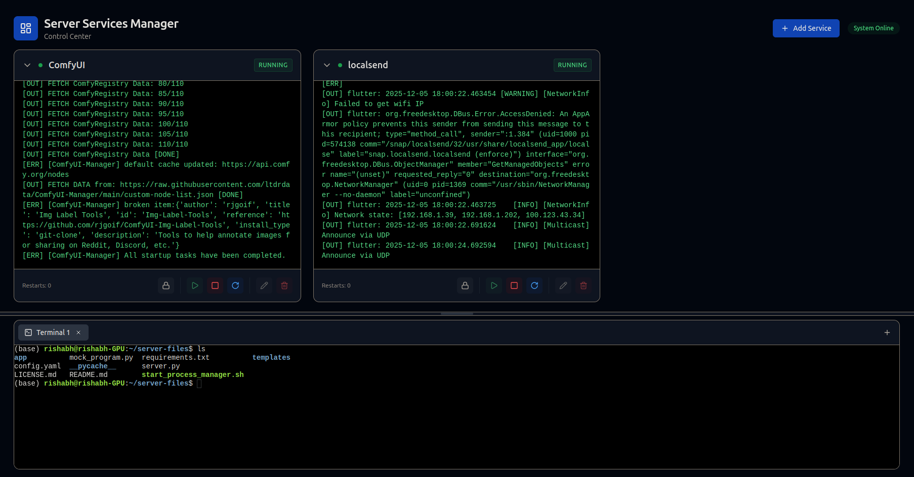
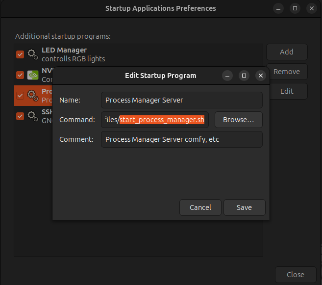

# Server Services Manager

A robust, web-based process manager for controlling server services and terminals.



## Features

- **Service Management**: Start, stop, restart, and monitor services.
- **Web Terminal**: Integrated multi-tab terminal for direct server control.
- **File Manager**: Upload and download files to/from the server.
- **Real-time Updates**: Live status updates and logs via WebSockets.
- **Authentication**: Simple password protection for access control.
- **Responsive UI**: Modern, dark-themed interface built with Tailwind CSS.

## Installation

1. Clone the repository:

   ```bash
   git clone https://github.com/Rishabh-Bajpai/server-services-manager.git
   cd server-services-manager
   ```

2. Install dependencies:

   ```bash
   pip install -r requirements.txt
   ```

3. Configure authentication:

   Create a `.env` file in the root directory:

   ```bash
   echo "PASSWORD=your_secure_password" > .env
   ```

   > Default password is `admin` if not configured.

## Usage

1. Start the server:

   ```bash
   python server.py
   ```

   Or use the startup script:

   ```bash
   ./start_process_manager.sh
   ```

2. Open your browser and navigate to `http://localhost:8001` (or the configured port).

## Configuration

- **Services**: Define your services via the GUI as shown below:
  
  

  Alternatively, define your services manually in `config.yaml`.

  Example `config.yaml`:

  ```yaml
  programs:
    - autostart: true
      command: conda run -n <env> --no-capture-output python main.py --listen
      cwd: /home/user/<app>
      environment: {}
      name: <app>
    - autostart: false
      command: <app>
      cwd: /home/user/Downloads
      environment: {}
      name: <app>
  ```

- **Environment**: Use `.env` to configure the application password and other secrets (optional).
  
  ```bash
  PASSWORD=your_secure_password
  SECRET_KEY=secret!
  ```

- **Autostart on boot**: Edit and add the startup script (start_process_manager.sh) to your system's startup applications.


## License

MIT
